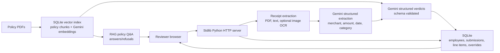

# Northwind Expense Pre-Review

Northwind Expense Pre-Review is a browser-based AI-assisted finance review tool for the case study. It ingests receipts, extracts line-item facts, checks them against the provided policy PDFs, stores reviewer history in SQLite, and returns verdicts with quoted policy support.

## Run Locally

1. Extract `case_study.zip` so the repository contains `case_study/CANDIDATE_BRIEF.pdf`, `case_study/policies/`, and `case_study/submissions/`.
2. Install dependencies:

```bash
python -m pip install -r requirements.txt
```

3. Start the app:

```bash
python northwind_app.py
```

4. Open `http://127.0.0.1:8000`.

The review pipeline now requires `GEMINI_API_KEY` for structured receipt extraction, policy retrieval embeddings, policy Q&A, and verdict generation. Image receipts first try local `pytesseract` if installed; otherwise Gemini vision is used when the key is configured. Without a key, the app starts but routes receipts/questions to `needs_review` or refusal instead of guessing.

Useful environment variables:

```bash
CASE_STUDY_DIR=/path/to/case_study
NORTHWIND_DB=/path/to/northwind.sqlite
NORTHWIND_UPLOADS=/path/to/runtime_uploads
HOST=127.0.0.1
PORT=8000
GEMINI_API_KEY=...
GEMINI_MODEL=gemini-2.5-flash
GEMINI_VISION_MODEL=gemini-2.5-flash
GEMINI_EMBEDDING_MODEL=gemini-embedding-001
NORTHWIND_RETRIEVAL_TOP_K=6
```

## Deploy On Render

This repo includes `render.yaml` for a Render Blueprint deployment. Create a new Blueprint in Render from the GitHub repo and branch `main`; Render will use:

- Build command: `pip install -r requirements.txt`
- Start command: `python northwind_app.py`
- Health check: `/api/health`
- Runtime: Python `3.13.5`
- Persistent disk: `/opt/render/project/src/render_data`

Set `GEMINI_API_KEY` in the Render Blueprint/environment prompt. Do not commit the local `.env` file.

The Blueprint uses Render's `starter` plan because SQLite, uploaded receipts, and policy embeddings need persistent disk storage. Render's free web service filesystem is ephemeral, so it is not a good fit for preserving reviewer history.

## Architecture



## Additions beyond the brief

Two additions, both motivated by one belief: in production, an AI system is judged not just by whether it gets the right answer, but by whether it can show its work and be measured along the way.

### 1. Pipeline step trace

In multi-step pipelines, debugging silent failures is often the most expensive failure mode. A reviewer may see a surprising verdict, but the engineering question is more precise: did extraction fail, did categorization drift, did the wrong policy clause get retrieved, did validation break, or was confidence calibrated too aggressively? Per-step telemetry is the diagnostic surface for answering that question.

Each receipt now stores a per-receipt trace with `step_name`, `model_used`, `latency_ms`, `cost_usd`, `status`, and `notes`. The trace is persisted alongside each verdict in SQLite and surfaced in the line-item UI as a collapsed "Pipeline trace" section, so it does not disturb the normal review workflow unless someone needs to inspect it.

The current architecture records Gemini extraction, embedding, retrieval, and verdict calls in the same trace surface. Schema validation and confidence checks remain deterministic guardrails after the model call, so malformed or weakly supported outputs route to human review rather than being silently accepted.

Tradeoff: the trace adds small timing overhead and additional storage per verdict. I judged that worth it because a compact trace is much cheaper than debugging an opaque AI workflow from final outputs alone.

### 2. Extended evaluation metrics

Accuracy alone hides systems that are slow, expensive, or quietly hallucinating well-formed wrong answers. The harness still prints the original metrics first, unchanged, but now appends operational metrics that describe whether the system is usable in production.

The added metrics are `latency_p50_ms`, `latency_p95_ms`, `mean_cost_usd_per_submission`, `mean_cost_usd_per_receipt`, `schema_validation_failure_rate`, `refusal_rate_on_out_of_scope_queries`, and `retrieval_recall_at_k`. Retrieval now uses Gemini embeddings over SQLite-stored policy chunks; richer recall measurement can be added once fixtures include expected supporting chunk IDs.

`schema_validation_failure_rate` tracks whether model outputs survive the typed `ReviewResult` validation path. The app uses Gemini structured JSON output, then coerces and bounds fields before persisting anything.

Tradeoff: more metrics can become noise. I kept the set small because each metric maps to a distinct production failure mode: slow, expensive, malformed, or overconfident on unknowns.

### 3. Eval-driven fix: closing the out-of-scope refusal gap

The first extended harness run surfaced a real weakness: `refusal_rate_on_out_of_scope_queries` was `80%`. The question "Who is the CFO of Apple?" retrieved irrelevant Northwind policy text because the earlier Q&A path over-weighted incidental text overlap. That was not a model hallucination, but it was still a bad grounded-answer failure: the answer was grounded in a real policy quote, yet irrelevant to the user's question.

The earlier refusal gate has been replaced by RAG refusal behavior. Policy Q&A embeds the question, retrieves policy chunks, and asks Gemini to answer only from those chunks. If the retrieved evidence does not support an answer, the response is marked refused.

After this fix, the same out-of-scope fixture reports `100%` refusal while `line_item_accuracy`, `citation_coverage`, and `policy_qa` remain at `1.0`. This is the kind of eval-driven correction I would want in a real deployment: the harness found an over-answering failure, the fix targeted the smallest responsible surface, and the original receipt verdict behavior stayed unchanged.

Tradeoff: RAG refusal behavior can under-answer if retrieval misses the right chunk. I accepted that bias because, for policy Q&A, refusing an ambiguous question is safer than confidently answering a non-policy question with irrelevant but real policy text.

## Design Choices

I chose a dependency-light Python service rather than a framework-heavy stack so the graders can run it quickly in a clean environment. The UI is plain HTML/CSS/JavaScript served by the app, and persistence is SQLite so submissions and overrides survive restarts.

The review engine is now LLM-first with deterministic guardrails. Gemini extracts typed receipt facts, the vector store retrieves relevant policy chunks, and Gemini returns a schema-constrained verdict with citation chunk IDs. Validation rejects malformed enums, missing citations, and weak extraction confidence by routing the item to `needs_review`.

Retrieval uses a lightweight SQLite vector store. Policy PDFs are chunked into citation-sized records, embedded with Gemini embeddings, stored as normalized float vectors, and searched with cosine similarity. Each verdict stores the retrieved policy quotes used to support it.

Image receipts are handled as an optional extension. Local OCR is attempted when `pytesseract` is available; otherwise Gemini vision is used when `GEMINI_API_KEY` is configured. Without either, image receipts are marked `needs_review` rather than guessed.

Confidence is not presented as model certainty. It is a review-quality signal bounded by extraction completeness, citation support, and Gemini's structured verdict confidence. Missing OCR, malformed model output, or absent citations route to human review.

## Reviewer Workflow

- Pick one of the seeded employees or create a new employee with trip context.
- Upload mixed receipt files.
- Review every line item with category, verdict, confidence, reasoning, and policy quotes.
- Save an override with a required comment. Overrides are appended to an audit log and never erase the original system verdict.
- Browse historical submissions by status and employee context after restart.
- Ask policy questions and receive grounded answers or refusals.

## Evaluation Harness

Start the app, then run:

```bash
python eval_harness.py --base-url http://127.0.0.1:8000 --case-dir case_study --expected sample_expected.json
```

The harness accepts a JSON file with held-out submission folders, expected verdicts by receipt filename, and policy questions. It reports:

- `line_item_accuracy`: exact verdict match for expected receipt outcomes.
- `citation_coverage`: share of reviewed line items with at least one quoted policy citation.
- `policy_qa`: correctness of refusal behavior plus required answer terms.

The expected JSON shape is intentionally simple:

```json
{
  "submissions": [
    {
      "folder": "03_dinner_over_cap",
      "expected_verdicts": {
        "04_dinner_alinea.pdf": "flagged"
      }
    }
  ],
  "questions": [
    {
      "question": "What is the dinner cap?",
      "must_contain": ["dinner"]
    },
    {
      "question": "Who won the NBA finals?",
      "should_refuse": true
    }
  ]
}
```

## Rough Cost

For PDF and text receipts, runtime model cost now includes Gemini structured extraction, query embeddings, and verdict generation. The trace captures token counts where Gemini returns usage metadata; Gemini pricing is intentionally left configurable in code so stale rates are not presented as audited costs.

If image OCR uses Gemini vision, cost depends on image count and resolution. At production volume, I would batch queue OCR, downscale images before upload, cache perceptual hashes, and reuse policy embeddings so recurring costs are concentrated in extraction and verdict calls.

## Scaling Plan

At 10,000 submissions per day, I would split this into ingestion workers, an extraction service, a policy retrieval service, and an API/UI service. SQLite would become Postgres. Receipt files would move to object storage. Policy chunks would be versioned and indexed in a managed vector store or Postgres `pgvector`, with reranking for citation faithfulness. Processing would be asynchronous through a queue so reviewers can see progress while receipts are processed. Overrides and original verdicts would remain append-only for auditability.

## Next Steps

- Add expected supporting chunk IDs to eval fixtures so retrieval recall@k can be measured directly.
- Add visual side-by-side receipt preview and highlighted extracted fields.
- Add reviewer filters by status, date range, department, and policy type.
- Add authentication and role-based access.
- Add richer eval data: extraction F1, violation recall, false-positive rate, citation support grading, and out-of-scope refusal tests.
- Add deployment manifests for a small container target.
