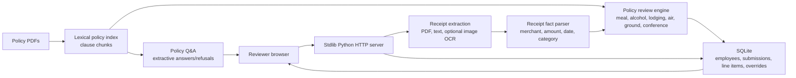

# Northwind Expense Pre-Review

Northwind Expense Pre-Review is a browser-based AI-assisted finance review tool for the case study. It ingests receipts, extracts line-item facts, checks them against the provided policy PDFs, stores reviewer history in SQLite, and returns verdicts with quoted policy support.

## Run Locally

1. Extract `case_study.zip` so the repository contains `case_study/CANDIDATE_BRIEF.pdf`, `case_study/policies/`, and `case_study/submissions/`.
2. Install dependencies:

```bash
python -m pip install -r requirements.txt
```

3. Start the app:

```bash
python northwind_app.py
```

4. Open `http://127.0.0.1:8000`.

The app runs without an API key for PDF and text receipts. For image receipts, it first tries local `pytesseract` if installed. If `OPENAI_API_KEY` is present, it can call a vision-capable OpenAI model through the Responses API for OCR-style extraction. Set `OPENAI_VISION_MODEL` to override the default model.

Useful environment variables:

```bash
CASE_STUDY_DIR=/path/to/case_study
NORTHWIND_DB=/path/to/northwind.sqlite
NORTHWIND_UPLOADS=/path/to/runtime_uploads
HOST=127.0.0.1
PORT=8000
OPENAI_API_KEY=...
OPENAI_VISION_MODEL=gpt-4o-mini
```

## Architecture



## Additions beyond the brief

Two additions, both motivated by one belief: in production, an AI system is judged not just by whether it gets the right answer, but by whether it can show its work and be measured along the way.

### 1. Pipeline step trace

In multi-step pipelines, debugging silent failures is often the most expensive failure mode. A reviewer may see a surprising verdict, but the engineering question is more precise: did extraction fail, did categorization drift, did the wrong policy clause get retrieved, did validation break, or was confidence calibrated too aggressively? Per-step telemetry is the diagnostic surface for answering that question.

Each receipt now stores a per-receipt trace with `step_name`, `model_used`, `latency_ms`, `cost_usd`, `status`, and `notes`. The trace is persisted alongside each verdict in SQLite and surfaced in the line-item UI as a collapsed "Pipeline trace" section, so it does not disturb the normal review workflow unless someone needs to inspect it.

The architectural reality is intentionally boring: the verdict path is deterministic by design, so most trace steps record `model_used="deterministic"` and `cost_usd=$0`. The model and cost fields become meaningful on the image-OCR path, where `gpt-4o-mini` can be used when `OPENAI_API_KEY` is configured, with `pytesseract` as the local fallback. Keeping verdict generation deterministic makes it reproducible, auditable, and free of hallucination risk; LLM cost is reserved for the place where it is hardest to replace, vision OCR on image receipts.

Tradeoff: the trace adds small timing overhead and additional storage per verdict. I judged that worth it because a compact trace is much cheaper than debugging an opaque AI workflow from final outputs alone.

### 2. Extended evaluation metrics

Accuracy alone hides systems that are slow, expensive, or quietly hallucinating well-formed wrong answers. The harness still prints the original metrics first, unchanged, but now appends operational metrics that describe whether the system is usable in production.

The added metrics are `latency_p50_ms`, `latency_p95_ms`, `mean_cost_usd_per_submission`, `mean_cost_usd_per_receipt`, `schema_validation_failure_rate`, `refusal_rate_on_out_of_scope_queries`, and `retrieval_recall_at_k`. Retrieval recall is intentionally skipped with an explicit note because this implementation uses deterministic clause resolution rather than a ranked vector retrieval benchmark; citation quality is already covered by `citation_coverage`.

`schema_validation_failure_rate` is `0` by construction in the current verdict path. The pipeline returns `ReviewResult` dataclass instances directly rather than parsing unconstrained LLM text, so there is no LLM output to fail schema validation. Reporting that as zero is a fact about this architecture, not a hidden success claim.

Tradeoff: more metrics can become noise. I kept the set small because each metric maps to a distinct production failure mode: slow, expensive, malformed, or overconfident on unknowns.

### 3. Eval-driven fix: closing the out-of-scope refusal gap

The first extended harness run surfaced a real weakness: `refusal_rate_on_out_of_scope_queries` was `80%`. The question "Who is the CFO of Apple?" retrieved irrelevant Northwind policy text because the lexical Q&A path matched the word "CFO" in internal policy clauses. That was not a model hallucination, but it was still a bad grounded-answer failure: the answer was grounded in a real policy quote, yet irrelevant to the user's question.

The fix was deliberately deterministic and narrow. Policy Q&A now runs a `scope_check` before retrieval. The gate is default-deny: a question must contain a Northwind policy-domain term or a policy document ID pattern before retrieval is allowed. The allowlist is grounded in the policy library's real domains, such as expenses, receipts, reimbursement, travel, lodging, meals, ground transportation, corporate card, approvals, vendors, alcohol, conferences, audits, and policy IDs like `TEP-002` or `HR-104`. If no policy-domain term is detected, the system refuses with a clear non-hallucinating response.

After this fix, the same out-of-scope fixture reports `100%` refusal while `line_item_accuracy`, `citation_coverage`, and `policy_qa` remain at `1.0`. This is the kind of eval-driven correction I would want in a real deployment: the harness found an over-answering failure, the fix targeted the smallest responsible surface, and the original receipt verdict behavior stayed unchanged.

Tradeoff: a default-deny allowlist can under-answer if the vocabulary is too narrow. I accepted that bias because, for policy Q&A, refusing an ambiguous question is safer than confidently answering a non-policy question with irrelevant but real policy text.

## Design Choices

I chose a dependency-light Python service rather than a framework-heavy stack so the graders can run it quickly in a clean environment. The UI is plain HTML/CSS/JavaScript served by the app, and persistence is SQLite so submissions and overrides survive restarts.

The review engine is deterministic first. Receipts are classified into air, lodging, ground, meal, conference, or unknown. Policy checks are explicit functions for the clauses most relevant to travel and expense review: meal caps, Tier 1 meal uplift, alcohol restrictions, lodging tiers and Concur exceptions, air class rules, rideshare category and tip checks, conference-included meals, and receipt completeness. This makes failures inspectable and avoids hiding business logic inside free-text model output.

Retrieval is lexical over clause-like chunks extracted from the policy PDFs. Each verdict stores the policy quotes used to support it. The ad-hoc Q&A path uses the same index and refuses when there is not enough policy overlap. A production version would likely use embeddings plus reranking, but this baseline is fast, cheap, deterministic, and easier to audit.

Image receipts are handled as an optional extension. Local OCR is attempted when `pytesseract` is available; otherwise an OpenAI vision call is used when `OPENAI_API_KEY` is configured. Without either, image receipts are marked `needs_review` rather than guessed.

Confidence is not presented as model certainty. It is a review-quality signal based on extraction completeness, rule strength, and whether the citation is direct. Hard policy matches such as solo alcohol or lodging cap overages receive higher confidence; missing OCR or unknown categories receive low confidence and are routed to a human.

## Reviewer Workflow

- Pick one of the seeded employees or create a new employee with trip context.
- Upload mixed receipt files.
- Review every line item with category, verdict, confidence, reasoning, and policy quotes.
- Save an override with a required comment. Overrides are appended to an audit log and never erase the original system verdict.
- Browse historical submissions by status and employee context after restart.
- Ask policy questions and receive grounded answers or refusals.

## Evaluation Harness

Start the app, then run:

```bash
python eval_harness.py --base-url http://127.0.0.1:8000 --case-dir case_study --expected sample_expected.json
```

The harness accepts a JSON file with held-out submission folders, expected verdicts by receipt filename, and policy questions. It reports:

- `line_item_accuracy`: exact verdict match for expected receipt outcomes.
- `citation_coverage`: share of reviewed line items with at least one quoted policy citation.
- `policy_qa`: correctness of refusal behavior plus required answer terms.

The expected JSON shape is intentionally simple:

```json
{
  "submissions": [
    {
      "folder": "03_dinner_over_cap",
      "expected_verdicts": {
        "04_dinner_alinea.pdf": "flagged"
      }
    }
  ],
  "questions": [
    {
      "question": "What is the dinner cap?",
      "must_contain": ["dinner"]
    },
    {
      "question": "Who won the NBA finals?",
      "should_refuse": true
    }
  ]
}
```

## Rough Cost

For PDF and text receipts, runtime model cost is zero. The only compute cost is local extraction, parsing, retrieval, and SQLite writes. On a small server, a typical 6 to 8 receipt submission should process in a few seconds.

If image OCR uses a vision model, cost depends on image count and resolution. A practical production estimate is one low-cost vision call per image receipt plus a small text-only model call only for ambiguous extraction. For 10,000 submissions per day with six receipts each and 20% images, that is about 12,000 vision calls/day plus local processing for the rest. I would batch queue OCR, downscale images before upload, cache perceptual hashes, and use deterministic rules before model calls to keep spend predictable.

## Scaling Plan

At 10,000 submissions per day, I would split this into ingestion workers, an extraction service, a policy retrieval service, and an API/UI service. SQLite would become Postgres. Receipt files would move to object storage. Policy chunks would be versioned and indexed in a managed vector store or Postgres `pgvector`, with reranking for citation faithfulness. Processing would be asynchronous through a queue so reviewers can see progress while receipts are processed. Overrides and original verdicts would remain append-only for auditability.

## Next Steps

- Add schema-constrained LLM extraction for messy receipts, with deterministic validation after extraction.
- Add visual side-by-side receipt preview and highlighted extracted fields.
- Add reviewer filters by status, date range, department, and policy type.
- Add authentication and role-based access.
- Add richer eval data: extraction F1, violation recall, false-positive rate, citation support grading, and out-of-scope refusal tests.
- Add deployment manifests for a small container target.
