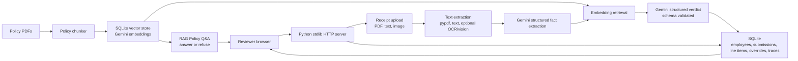

# Northwind Expense Pre-Review

Northwind Expense Pre-Review is a browser-based AI-assisted finance review tool for the Northwind Logistics case study. It helps a human finance reviewer process employee expense submissions by extracting receipt facts, retrieving relevant policy clauses, producing cited preliminary verdicts, and preserving reviewer overrides for auditability.

The system is intentionally a pre-review tool, not an auto-approver. It highlights what looks compliant, what appears to violate policy, and what is ambiguous enough to need a human eye.

## Live Deployment

The repository includes a Render Blueprint in `render.yaml`. Deploy it from Render against the `main` branch and provide `GEMINI_API_KEY` when prompted.

The Blueprint configures:

- Python web service
- Build command: `pip install -r requirements.txt`
- Start command: `python northwind_app.py`
- Health check: `/api/health`
- Persistent disk for SQLite, uploads, and policy embeddings
- Gemini model defaults: `gemini-2.5-flash` and `gemini-embedding-001`

## What Reviewers Can Do

- Start a new expense submission from a normal browser.
- Pick one of the five seeded sample employees loaded from `case_study/submissions/*/employee_info.json`.
- Create a new employee with identity, grade, department, and trip context.
- Upload mixed receipt formats: PDF, text, and image files.
- See one pre-review result per receipt line item.
- Review extracted vendor, date, category, amount, verdict, confidence, reasoning, and quoted policy support.
- Visually distinguish compliant, flagged, rejected, and needs-review items.
- Override any system verdict with a required comment.
- Reopen historical submissions after restart because state is persisted in SQLite.
- Ask ad-hoc policy questions and receive grounded cited answers, or a refusal when the question is outside the policy library.

## How To Use The App

1. Open the app in a browser.
2. In the `New` tab, select a seeded employee or create a new employee.
3. Confirm or enter the trip purpose and trip dates. Trip context matters for some policy decisions.
4. Upload one or more receipts.
5. Click `Run pre-review`.
6. Review each line item:
   - `compliant` means the system found no policy issue in the supplied evidence.
   - `flagged` means the item may be reimbursable in part or may need reviewer attention.
   - `rejected` means the supplied evidence indicates a clearly non-reimbursable issue.
   - `needs_review` means extraction, retrieval, citation support, or confidence was not strong enough.
7. Use the override controls when the finance reviewer disagrees with the system. Overrides are appended to the audit log and do not erase the original verdict.
8. Use `History` to reopen prior submissions.
9. Use `Policy Q&A` to ask questions about Northwind policies. The answer area shows a loading indicator while Gemini is generating the response.

## Run Locally

1. Make sure the repo contains:

```text
case_study/CANDIDATE_BRIEF.pdf
case_study/policies/
case_study/submissions/
```

2. Install dependencies:

```bash
python -m pip install -r requirements.txt
```

3. Create a local `.env` from `.env.example`:

```bash
GEMINI_API_KEY=your-gemini-api-key
GEMINI_MODEL=gemini-2.5-flash
GEMINI_VISION_MODEL=gemini-2.5-flash
GEMINI_EMBEDDING_MODEL=gemini-embedding-001
NORTHWIND_RETRIEVAL_TOP_K=6
```

4. Start the app:

```bash
python northwind_app.py
```

5. Open `http://127.0.0.1:8000`.

Useful environment variables:

```bash
CASE_STUDY_DIR=/path/to/case_study
NORTHWIND_DB=/path/to/northwind.sqlite
NORTHWIND_UPLOADS=/path/to/runtime_uploads
HOST=127.0.0.1
PORT=8000
GEMINI_API_KEY=...
GEMINI_MODEL=gemini-2.5-flash
GEMINI_VISION_MODEL=gemini-2.5-flash
GEMINI_EMBEDDING_MODEL=gemini-embedding-001
NORTHWIND_RETRIEVAL_TOP_K=6
```

Without `GEMINI_API_KEY`, the server still starts, but receipt review falls back to `needs_review` and policy Q&A refuses rather than fabricating.

## Deploy On Render

The Render Blueprint is checked in as `render.yaml`.

1. Push this repo to GitHub.
2. In Render, create a new Blueprint from the repository.
3. Select branch `main`.
4. Enter `GEMINI_API_KEY` when Render prompts for unsynced environment variables.
5. Deploy.

The Blueprint uses the `starter` plan because this app uses SQLite, uploaded receipts, and policy embeddings. Render's free filesystem is ephemeral; preserving reviewer history requires a persistent disk.

## Architecture



## Pipeline

1. **Startup**
   - Loads `.env` if present.
   - Seeds employees from the provided sample submission folders.
   - Extracts and chunks policy PDFs.
   - Builds or reuses SQLite-stored Gemini embeddings for policy chunks when `GEMINI_API_KEY` is configured.

2. **Receipt ingestion**
   - PDF receipts are extracted with `pypdf`.
   - Plain-text receipts are read directly.
   - Image receipts try local `pytesseract`; if unavailable, Gemini vision extracts visible receipt text.

3. **Structured extraction**
   - Gemini returns schema-constrained receipt facts: vendor, date, category, meal type, amount, subtotal, tip, tax, nights, city, confidence, and warnings.
   - Missing or malformed extraction fields are coerced into safe nullable values.

4. **Retrieval**
   - The receipt facts, trip context, and related receipts are embedded as a retrieval query.
   - The app retrieves the top policy chunks from SQLite by cosine similarity.

5. **Verdict generation**
   - Gemini receives the extracted facts, employee/trip context, related receipts, and retrieved policy chunks.
   - It returns a schema-constrained verdict with confidence, reasoning, reimbursable amount, non-reimbursable amount, and supporting chunk IDs.
   - The app validates verdict enums and requires citation support. Weak outputs route to `needs_review`.

6. **Persistence and audit**
   - Submissions, line items, citations, extracted text, overrides, and pipeline traces are stored in SQLite.
   - Overrides are append-only comments attached to line items.

## Feature Coverage

| Candidate brief capability | Implementation |
| --- | --- |
| Browser-based reviewer workflow | Single-page HTML/CSS/JS UI served by the Python app |
| Seed employees from sample data | `seed_employees()` loads the five provided employee JSON files at startup |
| Upload mixed receipt formats | PDF, text, and common image formats are accepted |
| Extract line-item facts | Gemini structured extraction from receipt text/OCR |
| Show verdict, category, reasoning, confidence | Rendered per line item in the review workspace |
| Quote supporting policy clauses | Retrieved policy chunk quotes are stored and displayed |
| Make flagged items visually distinct | Status badges and colors distinguish outcomes |
| Reviewer overrides | Required comments are persisted as an audit log |
| Submission history after restart | SQLite persistence for employees, submissions, items, overrides |
| Policy Q&A with refusals | RAG answer generation cites chunks or refuses unsupported questions |
| Evaluation harness | `eval_harness.py` accepts expected outcomes JSON and reports metrics |

## Design Choices And Tradeoffs

### Lightweight service

The app uses the Python standard library HTTP server rather than Flask/FastAPI. That keeps the case-study repo easy to run with minimal dependencies, and the UI/API surface is small enough that a framework would not add much value yet.

Tradeoff: a production system should move to a framework with middleware, auth, request validation, background jobs, and observability.

### SQLite persistence

SQLite stores reviewer state, overrides, traces, policy chunks, and embeddings. It satisfies the brief's persistence requirement without external infrastructure.

Tradeoff: SQLite is not the right long-term store for concurrent finance operations at high scale. At production volume, I would move submissions and overrides to Postgres and policy vectors to `pgvector` or a managed vector store.

### Gemini 2.5 Flash

`gemini-2.5-flash` is used for structured receipt extraction, policy Q&A, and verdict generation. It is fast enough for an interactive reviewer workflow while still strong enough for messy receipts and policy reasoning.

Tradeoff: a more expensive model might improve edge-case reasoning. The app compensates with retrieval, schema-constrained output, citation validation, and `needs_review` fallbacks.

### Retrieval and chunking

Policies are chunked into citation-sized text records, embedded with `gemini-embedding-001`, and stored in SQLite as normalized float vectors. Retrieval uses cosine similarity over those vectors.

Tradeoff: SQLite vector search is simple and transparent for this case-study size. For 10,000 submissions/day or a much larger policy library, I would use Postgres `pgvector`, a managed vector DB, and a reranker for citation faithfulness.

### Schema-constrained outputs

LLM outputs are requested as JSON matching explicit schemas. The app still validates and coerces fields before saving.

Tradeoff: schemas reduce malformed output risk but do not guarantee policy correctness. That is why every verdict must cite retrieved policy text and low-support cases become `needs_review`.

### Confidence and human review

Confidence is a review-quality signal, not a guarantee that the model is correct. It combines extraction completeness, model confidence, and citation support. Missing OCR, absent citations, or malformed outputs are routed to humans.

Tradeoff: this can create more human review work, but it is safer than confidently approving unsupported or ambiguous expenses.

### Flagged vs rejected vs needs-review

- `flagged`: evidence suggests a policy concern, but the item may be partially reimbursable or may need reviewer judgment.
- `rejected`: evidence clearly supports non-reimbursement.
- `needs_review`: the system lacks enough evidence, extraction quality, or citation support to make a reliable recommendation.

This preserves the CFO's desired workflow: the system does the heavy lifting, but a human reviewer remains the final authority.

## Evaluation Harness

Start the app, then run:

```bash
python eval_harness.py --base-url http://127.0.0.1:8000 --case-dir case_study --expected sample_expected.json
```

The harness accepts a JSON file with held-out submission folders, expected verdicts by receipt filename, and policy questions. It reports:

- `line_item_accuracy`: exact verdict match for expected receipt outcomes.
- `citation_coverage`: share of reviewed line items with at least one quoted policy citation.
- `policy_qa`: correctness of refusal behavior plus required answer terms.
- `latency_p50_ms` and `latency_p95_ms`: end-to-end submission latency.
- `mean_cost_usd_per_submission` and `mean_cost_usd_per_receipt`: traced model cost where pricing is configured.
- `schema_validation_failure_rate`: model-output pressure on the schema validation layer.
- `refusal_rate_on_out_of_scope_queries`: whether policy Q&A declines unrelated questions.
- `retrieval_recall_at_k`: currently skipped until fixtures include expected supporting chunk IDs.

Example expected JSON:

```json
{
  "submissions": [
    {
      "folder": "03_dinner_over_cap",
      "expected_verdicts": {
        "04_dinner_alinea.pdf": "flagged"
      }
    }
  ],
  "questions": [
    {
      "question": "What is the dinner cap?",
      "must_contain": ["dinner"]
    },
    {
      "question": "Who won the NBA finals?",
      "should_refuse": true
    }
  ]
}
```

## Rough Cost

For each PDF/text receipt, the app typically performs:

- One Gemini structured extraction call.
- One Gemini embedding query for retrieval.
- One Gemini structured verdict call.

Policy-document embeddings are cached in SQLite and reused across submissions. Image receipts may add one vision/OCR call if local OCR is unavailable.

Exact cost depends on Gemini pricing, receipt length, and image usage. The trace stores token usage where the API returns it. In production, I would monitor mean cost per receipt and add caching for duplicate receipt files and repeated policy Q&A questions.

## Scaling To 10,000 Submissions Per Day

At 10,000 submissions/day, I would split the app into:

- Ingestion API and reviewer UI.
- Asynchronous receipt-processing workers.
- Dedicated extraction service.
- Dedicated policy retrieval service.
- Postgres for submissions, overrides, and audit records.
- Object storage for receipt files.
- `pgvector` or managed vector storage for policy chunks.
- Queue-based processing so reviewers can watch status update rather than waiting on synchronous uploads.

I would also add:

- Authentication and role-based access.
- Append-only audit events for every model verdict and reviewer action.
- Versioned policy indexes, so old verdicts can be traced to the policy version used at the time.
- Reranking or LLM citation grading to improve citation faithfulness.
- Dashboards for latency, cost, refusal rate, override rate, and false-positive/false-negative trends.

## Next Steps

- Add visual side-by-side receipt preview with highlighted extracted fields.
- Add filters by employee, date, status, department, and policy type.
- Add auth and reviewer roles.
- Add background processing for long uploads.
- Add expected supporting chunk IDs to eval fixtures so retrieval recall@k can be measured directly.
- Add extraction F1, violation recall, false-positive rate, and citation support grading to the harness.
- Replace local SQLite with Postgres for multi-user production deployments.
